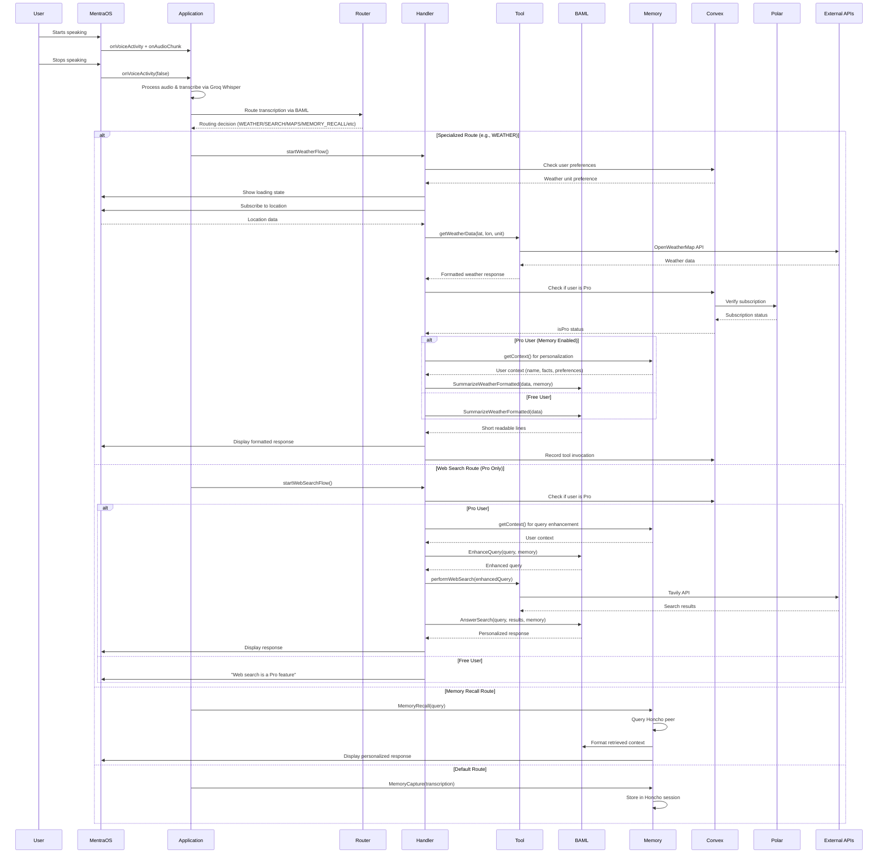

# 🔮 Clairvoyant

A real-time voice transcription and intelligent context-aware assistant built with MentraOS that captures audio, processes it through intelligent routing, and provides personalized responses using multiple AI tools, persistent memory, and subscription-based features.

## Overview

Clairvoyant is an advanced MentraOS application that provides real-time voice transcription with intelligent routing to specialized AI capabilities. It listens for voice activity, transcribes speech using Groq's Whisper, routes queries to appropriate tools (weather, search, maps, memory, etc.), and provides concise, contextual responses through AI-powered formatting and persistent memory integration. The application features a freemium model with Pro subscriptions powered by Polar, enabling advanced features like web search and personalized memory-enhanced responses.

## Architecture

The application integrates multiple layers across a monorepo structure:
- **MentraOS Framework**: Provides audio streaming, voice activity detection, and UI components
- **Intelligent Routing**: BAML-powered routing system that directs queries to appropriate handlers
- **Specialized Tools**: External API integrations (weather, search, maps, memory)
- **Handler Orchestration**: UX flow management with loading states and response formatting
- **AI Formatting**: BAML prompts that convert tool outputs to concise, readable responses
- **Persistent Memory**: Honcho-powered context and personalization system with memory injection
- **Subscription Management**: Polar-powered payment system for Pro features
- **Data Persistence**: Convex backend for user preferences, tool usage analytics, and subscription state

## Project Structure

Clairvoyant is organized as a monorepo using Turbo with the following structure:

```
clairvoyant/
├── apps/
│   ├── application/          # Main MentraOS application
│   │   └── src/
│   │       ├── index.ts                    # Application entry point
│   │       ├── transcriptionFlow.ts        # Central routing handler
│   │       ├── baml_client/                # Generated BAML client
│   │       ├── core/                       # Core utilities
│   │       │   ├── env.ts                 # Environment validation
│   │       │   ├── convex.ts              # Convex client & helpers
│   │       │   ├── textWall.ts            # UI text display helpers
│   │       │   ├── rateLimiting.ts        # API rate limiting
│   │       │   └── utils.ts               # Utility functions
│   │       ├── handlers/                  # Flow orchestrators
│   │       │   ├── weather.ts             # Weather handler (with memory)
│   │       │   ├── search.ts              # Web search handler (dual-layer memory)
│   │       │   ├── maps.ts                # Maps handler (with memory)
│   │       │   ├── knowledge.ts            # Knowledge handler (with memory)
│   │       │   └── memory.ts              # Memory capture/recall
│   │       ├── tools/                      # External API integrations
│   │       │   ├── weatherCall.ts         # OpenWeatherMap integration
│   │       │   ├── webSearch.ts           # Tavily web search
│   │       │   ├── mapsCall.ts            # Google Places API
│   │       │   └── memoryCall.ts          # Honcho memory initialization
│   │       └── types/                     # TypeScript definitions
│   │           └── schema.ts              # Zod validation schemas
│   │
│   ├── api/                  # Elysia API server
│   │   └── src/
│   │       ├── index.ts                   # API server entry point
│   │       ├── session.ts                 # Session management routes
│   │       ├── env.ts                     # API environment config
│   │       └── middleware/
│   │           ├── auth.ts                # Authentication middleware
│   │           └── mentra.ts              # MentraOS integration
│   │
│   └── web/                  # React web dashboard
│       └── src/
│           ├── App.tsx                    # Main app component
│           ├── components/
│           │   ├── HomePage.tsx           # Dashboard home
│           │   ├── SettingsPage.tsx       # User settings
│           │   ├── SubscriptionCard.tsx  # Subscription management
│           │   ├── ToolUsageChart.tsx     # Analytics visualization
│           │   └── ui/                    # UI components
│           ├── hooks/
│           │   └── useConvexAuth.ts      # Convex authentication
│           └── lib/
│               ├── api.ts                # API client
│               └── utils.ts              # Utilities
│
├── packages/
│   └── convex/               # Convex backend functions
│       ├── schema.ts                     # Database schema
│       ├── users.ts                      # User management
│       ├── preferences.ts                # User preferences
│       ├── toolInvocations.ts            # Tool usage analytics
│       ├── polar.ts                      # Polar subscription integration
│       └── auth.config.ts                # Authentication config
│
├── baml_src/                 # BAML prompt definitions
│   ├── route.baml           # Routing logic
│   ├── weather.baml         # Weather formatting
│   ├── search.baml          # Search formatting
│   ├── maps.baml            # Maps formatting
│   ├── recall.baml          # Memory recall formatting
│   ├── answer.baml          # Knowledge formatting
│   ├── synthesis.baml       # Memory synthesis
│   ├── core.baml            # Core utilities (EnhanceQuery)
│   ├── clients.baml         # AI client configurations
│   └── generators.baml      # Code generation settings
│
└── docs/
    └── MEMORY_INJECTION_PATTERN.md  # Memory integration guide
```

## System Flow



## Key Features

### 🧠 Intelligent Routing System
- **BAML-powered routing**: Automatically classifies queries into categories (weather, search, maps, memory, knowledge)
- **Context-aware routing**: Routes questions about user's personal information to memory system
- **Extensible routing**: Easy to add new categories and handlers
- **Route categories**:
  - `WEATHER`: Current/upcoming weather for specific locations
  - `WEB_SEARCH`: News, current events, time-sensitive information (Pro only)
  - `MAPS`: Nearby businesses, addresses, directions
  - `KNOWLEDGE`: General factual information
  - `MEMORY_RECALL`: Personal information, preferences, history
  - `MEMORY_CAPTURE`: Commands to store new personal facts or reminders

### 🔧 Modular Tool Architecture
- **Weather Tool**: OpenWeatherMap integration with location services and user preference support
- **Web Search Tool**: Tavily-powered real-time web search (Pro feature)
- **Maps Tool**: Google Places API for location queries
- **Memory Tool**: Honcho-powered persistent context and personalization
- **Knowledge Tool**: General knowledge questions via AI

### 🎯 Handler-Based Flow Management
- **Async flow orchestration**: Non-blocking handlers with stale request protection
- **Loading state management**: User-friendly loading/success/error states
- **Location integration**: Automatic location requests where needed
- **Timeout handling**: Graceful fallbacks for slow/failed operations
- **Pro feature gating**: Automatic subscription checks for premium features

### 🤖 AI-Powered Response Formatting
- **BAML prompt engineering**: Converts raw tool outputs to concise, readable responses
- **Token-efficient prompts**: Minimal data transfer with maximum information density
- **Consistent response format**: ≤3 lines, ≤10 words per line for optimal readability
- **Contextual formatting**: Responses tailored to user's query and personality
- **Memory-enhanced responses**: Personalized insights based on user context (Pro feature)

### 💾 Persistent Memory & Context System

#### Memory Architecture
- **Honcho integration**: Persistent memory across sessions
- **Peer-based conversations**: Dedicated "diatribe" peer for raw transcription storage
- **Personal context**: Remembers user preferences, history, and personal information
- **Memory-aware responses**: Leverages stored context for personalized interactions (Pro feature)

#### Memory Injection Pattern
Clairvoyant implements a sophisticated memory injection system that enhances tool responses with personalized context. See [`docs/MEMORY_INJECTION_PATTERN.md`](docs/MEMORY_INJECTION_PATTERN.md) for complete documentation.

**Two Implementation Layers:**
1. **Single-Layer (Post-Fetch)**: Memory enhances response formatting only (Weather, Knowledge, Maps)
2. **Dual-Layer (Pre + Post-Fetch)**: Memory enhances both query generation AND response formatting (Web Search)

**Memory Context Structure:**
- **peerCard**: Biographical facts (name, age, location, family, etc.)
- **peerRepresentation**: Explicit facts and deductive conclusions about user preferences
- **Temporal context**: Recent queries with timestamps for "what" and "when" awareness

**Example Memory-Enhanced Response:**
- Without memory: "Today's vibe: 9/10, sunny with a breeze feels nice!"
- With memory: "Today's vibe: 9/10, Ajay - perfect for your morning run!" (uses biographical fact)
- With deductive memory: "Today's vibe: 9/10, Ajay - chilly but you like cold weather!" (uses deductive conclusion)

### 💳 Subscription & Payment System

#### Polar Integration
- **Subscription management**: Powered by [Polar](https://polar.sh) for payment processing
- **Pro tier**: Unlocks advanced features including:
  - Web search functionality
  - Memory-enhanced personalized responses
  - Advanced context awareness
- **Free tier**: Basic features including weather, maps, knowledge, and memory capture/recall
- **Subscription state**: Stored in Convex and checked before Pro feature access

#### Subscription Flow
1. User attempts to use Pro feature (e.g., web search)
2. Application checks subscription status via Convex
3. Convex queries Polar for current subscription
4. If Pro: Feature enabled with full memory personalization
5. If Free: User sees upgrade prompt

### 📊 Analytics & User Preferences

#### Tool Usage Analytics
- **Usage tracking**: All tool invocations recorded in Convex
- **Daily aggregation**: Counts per tool per day
- **Analytics dashboard**: Web app displays usage charts and trends
- **Data structure**: `toolInvocations` table tracks `userId`, `router`, `count`, `date`

#### User Preferences
- **Weather unit**: Celsius or Fahrenheit preference
- **Default location**: Optional default location for weather queries
- **Preference storage**: Persisted in Convex `preferences` table
- **Settings UI**: Web dashboard for preference management

### 🎨 Smart UI Integration
- **Text wall displays**: Clean, timed text overlays in MentraOS interface
- **View management**: Automatic return to main view after responses
- **Duration optimization**: 3-second display timing for optimal readability
- **Error state handling**: Clear error messaging with automatic recovery
- **Web dashboard**: React-based admin interface for settings and analytics

## Setup Instructions

### Prerequisites
- [Bun](https://bun.sh) runtime (v1.3.3+)
- [Convex](https://convex.dev) account and project
- [Polar](https://polar.sh) account for subscriptions
- [ngrok](https://ngrok.com) for tunneling (development)
- API keys for: MentraOS, Groq, OpenAI, OpenWeatherMap, Tavily, Google Maps, Honcho

### Installation

1. **Install dependencies:**
```bash
bun install
```

2. **Set up Convex:**
```bash
npx convex dev
```
This will create a `.env.local` file with your Convex deployment URL.

3. **Set up Polar:**
   - Create a Polar account and organization
   - Create a product with a subscription plan
   - Get your organization token
   - Configure Polar in Convex dashboard

4. **Create environment files:**

**Root `.env.local`:**
```env
# MentraOS
PACKAGE_NAME=your-package-name
MENTRAOS_API_KEY=your-mentraos-api-key

# AI Services
GROQ_API_KEY=your-groq-api-key
OPENAI_API_KEY=your-openai-api-key

# External APIs
OPENWEATHERMAP_API_KEY=your-weather-api-key
TAVILY_API_KEY=your-tavily-api-key
GOOGLE_MAPS_API_KEY=your-google-maps-api-key

# Memory
HONCHO_API_KEY=your-honcho-api-key

# Convex (auto-generated by `npx convex dev`)
CONVEX_URL=your-convex-deployment-url

# Polar
POLAR_ORGANIZATION_TOKEN=your-polar-org-token

# API Server
API_PORT=3001
AUTH_PUBLIC_KEY_PEM=your-auth-public-key
AUTH_KEY_ID=your-auth-key-id
```

**Application `.env.local` (optional overrides):**
```env
PORT=3000
```

5. **Generate BAML client:**
```bash
npx baml-cli generate
```

6. **Sync Polar products to Convex:**
```bash
# Via Convex dashboard or API
# Products are synced automatically when configured
```

### Running the Application

#### Development Mode

1. **Start Convex backend:**
```bash
bun run database
# or
npx convex dev
```

2. **Start the application:**
```bash
bun run app:dev
# or
cd apps/application && bun run dev
```

3. **Start the API server (optional):**
```bash
bun run api:dev
# or
cd apps/api && bun run dev
```

4. **Start the web dashboard (optional):**
```bash
bun run web:dev
# or
cd apps/web && bun run dev
```

5. **Create a tunnel to expose your local server:**
```bash
ngrok http --url=your-ngrok-url.ngrok-free.app 3000
```

#### Production Build

```bash
# Build all apps
bun run build

# Build specific app
bun run web:build
```

## Deployment

Clairvoyant can be deployed to Railway (recommended for long-running services) or Vercel (recommended for web app and API serverless functions).

### Quick Reference

| Service | Recommended Platform | Alternative Platform | Notes |
|---------|---------------------|---------------------|-------|
| **Application** | Railway | - | Long-running MentraOS service |
| **API** | Railway | Vercel | Requires code changes for Vercel |
| **Web** | Vercel | Railway | Static site, works on both |

### Railway Deployment

Railway is ideal for deploying the **application** and **API** services as they are long-running processes. The **web** app can also be deployed to Railway as a static site.

#### Prerequisites
- [Railway account](https://railway.app)
- Railway CLI installed: `npm i -g @railway/cli`
- All environment variables configured

#### Deploy Application Service

1. **Create a new Railway project:**
   ```bash
   railway login
   railway init
   ```

2. **Link to existing service (if using railway.json):**
   ```bash
   railway link
   ```

3. **Configure the service:**
   - Set the **Root Directory** to the project root
   - The `railway.application.json` file will be automatically detected
   - Or manually configure:
     - **Build Command**: `bun install`
     - **Start Command**: `bun run --cwd apps/application start`
     - **Watch Patterns**: `apps/application/**`, `packages/convex/**`, `baml_src/**`, `package.json`, `bun.lock`

4. **Set environment variables:**
   ```bash
   railway variables set PACKAGE_NAME=your-package-name
   railway variables set MENTRAOS_API_KEY=your-mentraos-api-key
   railway variables set GROQ_API_KEY=your-groq-api-key
   railway variables set OPENAI_API_KEY=your-openai-api-key
   railway variables set OPENWEATHERMAP_API_KEY=your-weather-api-key
   railway variables set TAVILY_API_KEY=your-tavily-api-key
   railway variables set GOOGLE_MAPS_API_KEY=your-google-maps-api-key
   railway variables set HONCHO_API_KEY=your-honcho-api-key
   railway variables set CONVEX_URL=your-convex-deployment-url
   railway variables set PORT=3000
   ```

5. **Deploy:**
   ```bash
   railway up
   ```

6. **Get public domain:**
   ```bash
   railway domain
   ```
   Copy the generated domain and configure it in your MentraOS package settings.

#### Deploy API Service

1. **Create a new service in your Railway project:**
   ```bash
   railway service create api
   ```

2. **Link the service:**
   ```bash
   railway link --service api
   ```

3. **Configure the service:**
   - The `railway.api.json` file will be automatically detected
   - Or manually configure:
     - **Build Command**: `bun install`
     - **Start Command**: `bun run --cwd apps/api start`
     - **Watch Patterns**: `apps/api/**`, `packages/convex/**`, `package.json`, `bun.lock`

4. **Set environment variables:**
   ```bash
   railway variables set MENTRAOS_API_KEY=your-mentraos-api-key
   railway variables set CONVEX_URL=your-convex-deployment-url
   railway variables set AUTH_PUBLIC_KEY_PEM=your-auth-public-key
   railway variables set AUTH_PRIVATE_KEY_PEM=your-auth-private-key
   railway variables set AUTH_KEY_ID=your-auth-key-id
   railway variables set API_PORT=3001
   railway variables set RAILWAY_PUBLIC_DOMAIN=$(railway domain)
   ```

5. **Deploy:**
   ```bash
   railway up
   ```

#### Deploy Web App (Static Site)

1. **Create a new service:**
   ```bash
   railway service create web
   railway link --service web
   ```

2. **Configure the service:**
   - **Root Directory**: Leave as project root (monorepo)
   - **Build Command**: `bun install && bun run --cwd apps/web build`
   - **Start Command**: `bun run --cwd apps/web preview --port $PORT --host`
   - **Output Directory**: `apps/web/dist`
   - **Watch Patterns**: `apps/web/**`, `packages/convex/**`, `package.json`, `bun.lock`

3. **Set environment variables:**
   ```bash
   railway variables set VITE_CONVEX_URL=your-convex-deployment-url
   railway variables set VITE_API_BASE_URL=https://your-api-service.railway.app
   ```

4. **Deploy:**
   ```bash
   railway up
   ```

**Alternative:** Railway also supports static site hosting. You can configure it to serve the `apps/web/dist` directory directly without a preview server.

#### Railway Configuration Files

The project includes Railway configuration files:
- `railway.application.json`: Application service configuration
- `railway.api.json`: API service configuration

These files define build commands, start commands, and watch patterns for automatic deployments.

### Vercel Deployment

Vercel is ideal for deploying the **web** app (static site) and **API** (serverless functions). The **application** service should be deployed to Railway as it requires a long-running process.

#### Prerequisites
- [Vercel account](https://vercel.com)
- Vercel CLI installed: `npm i -g vercel`
- All environment variables configured

#### Deploy Web App

1. **Navigate to web app directory:**
   ```bash
   cd apps/web
   ```

2. **Deploy to Vercel:**
   ```bash
   vercel
   ```

3. **Configure build settings:**
   - **Framework Preset**: Vite
   - **Build Command**: `cd ../.. && bun install && bun run --cwd apps/web build`
   - **Output Directory**: `apps/web/dist`
   - **Install Command**: `cd ../.. && bun install`

4. **Set environment variables in Vercel dashboard:**
   - `VITE_CONVEX_URL`: Your Convex deployment URL
   - `VITE_API_BASE_URL`: Your API base URL (Railway or Vercel)

5. **For production deployment:**
   ```bash
   vercel --prod
   ```

#### Deploy API Service (Serverless)

**Note:** The API service uses Elysia with Bun runtime and is optimized for long-running processes. For best compatibility, we recommend deploying the API to Railway. However, Vercel deployment is possible with modifications.

**Option 1: Railway (Recommended)**
Follow the Railway API deployment instructions above for the best experience.

**Option 2: Vercel (Requires Code Changes)**

To deploy to Vercel, you'll need to modify the API to export a serverless handler:

1. **Create a Vercel handler file** (`apps/api/src/vercel.ts`):
   ```typescript
   import { app } from "./index";
   
   export default app.handle;
   ```

2. **Create `vercel.json` in project root:**
   ```json
   {
     "version": 2,
     "builds": [
       {
         "src": "apps/api/src/vercel.ts",
         "use": "@vercel/node"
       }
     ],
     "routes": [
       {
         "src": "/(.*)",
         "dest": "apps/api/src/vercel.ts"
       }
     ]
   }
   ```

3. **Deploy from project root:**
   ```bash
   vercel
   ```

4. **Set environment variables:**
   ```bash
   vercel env add MENTRAOS_API_KEY
   vercel env add CONVEX_URL
   vercel env add AUTH_PUBLIC_KEY_PEM
   vercel env add AUTH_PRIVATE_KEY_PEM
   vercel env add AUTH_KEY_ID
   vercel env add PUBLIC_BASE_URL
   ```

5. **Note:** The API code already includes Vercel origin detection for CORS. The `PUBLIC_BASE_URL` will be automatically set from `VERCEL_URL` if not explicitly provided. Remove the `.listen()` call in production when using Vercel.

6. **For production:**
   ```bash
   vercel --prod
   ```

**Important:** Since the API uses Bun-specific features, you may need to use a Node.js-compatible runtime or consider Railway for better Bun support.

#### Vercel Monorepo Configuration

If deploying from the monorepo root, configure Vercel to recognize the workspace structure:

1. **Create `vercel.json` in project root (for web app):**
   ```json
   {
     "buildCommand": "cd apps/web && bun install && bun run build",
     "outputDirectory": "apps/web/dist",
     "installCommand": "bun install",
     "framework": "vite"
   }
   ```

2. **Or use Vercel dashboard:**
   - Set **Root Directory** to `apps/web`
   - Configure build settings as above

### Deployment Architecture Recommendations

**Recommended Setup:**
- **Application**: Railway (long-running MentraOS service)
- **API**: Railway or Vercel (serverless functions)
- **Web**: Vercel (static site with CDN)

**Alternative Setup:**
- **All services**: Railway (simpler to manage, single platform)

### Environment Variables Checklist

Ensure all required environment variables are set in your deployment platform:

**Application Service:**
- `PACKAGE_NAME`
- `PORT`
- `MENTRAOS_API_KEY`
- `GROQ_API_KEY`
- `OPENAI_API_KEY`
- `OPENWEATHERMAP_API_KEY`
- `TAVILY_API_KEY`
- `GOOGLE_MAPS_API_KEY`
- `HONCHO_API_KEY`
- `CONVEX_URL`

**API Service:**
- `API_PORT` (or `PORT`)
- `MENTRAOS_API_KEY`
- `CONVEX_URL`
- `AUTH_PUBLIC_KEY_PEM`
- `AUTH_PRIVATE_KEY_PEM`
- `AUTH_KEY_ID`
- `PUBLIC_BASE_URL` (or `RAILWAY_PUBLIC_DOMAIN` for Railway)
- `ALLOWED_ORIGINS` (optional, comma-separated)

**Web App:**
- `VITE_CONVEX_URL`
- `VITE_API_BASE_URL`

### Post-Deployment Steps

1. **Update MentraOS package settings:**
   - Set the application service URL (Railway domain)
   - Configure webhook endpoints if needed

2. **Update Convex environment:**
   - Ensure `CONVEX_URL` matches your deployment
   - Verify Polar integration is configured

3. **Test endpoints:**
   - Application: Health check via MentraOS
   - API: Test `/health` or session endpoints
   - Web: Verify dashboard loads and connects to Convex

4. **Monitor logs:**
   - Railway: `railway logs`
   - Vercel: Dashboard or `vercel logs`

## Memory Injection Pattern

Clairvoyant implements a sophisticated memory injection system that enables personalized, context-aware responses. This pattern is documented in detail in [`docs/MEMORY_INJECTION_PATTERN.md`](docs/MEMORY_INJECTION_PATTERN.md).

### Quick Overview

**When to Use:**
- **Single-Layer Pattern**: For tools that fetch data first, then personalize the response (Weather, Knowledge, Maps)
- **Dual-Layer Pattern**: For tools that benefit from query enhancement before fetching (Web Search)

**Implementation Steps:**
1. Add `memorySession` and `peers` parameters to handler
2. Fetch memory context after data retrieval (single-layer) or before (dual-layer)
3. Extract user name, facts, and deductive conclusions
4. Pass memory context to BAML formatter
5. Update BAML function to accept optional `MemoryContextLite` parameter
6. Regenerate BAML client

**Example (Weather Handler):**
```typescript
// Fetch memory context after weather data
let memoryContext = null;
if (memorySession && peers && isPro) {
  const contextData = await memorySession.getContext({
    peerTarget: diatribePeer.id,
    lastUserMessage: "weather",
  });
  // Extract userName, userFacts, deductiveFacts
  memoryContext = { userName, userFacts, deductiveFacts };
}

// Pass to BAML formatter
const result = await b.SummarizeWeatherFormatted(weatherData, memoryContext);
```

**Key Principles:**
- Graceful degradation: Works without memory
- Pro-only feature: Memory injection requires active subscription
- Tool-specific filtering: Only relevant facts are used
- Temporal awareness: Recent queries included with timestamps
- Subtle integration: LLM weaves memories naturally

## Subscription & Payment

### Polar Setup

1. **Create Polar Organization:**
   - Sign up at [polar.sh](https://polar.sh)
   - Create an organization
   - Get your organization token

2. **Create Products:**
   - Create a "Pro" subscription product
   - Set pricing (monthly/yearly)
   - Configure webhook endpoints (optional)

3. **Configure Convex:**
   - Add `POLAR_ORGANIZATION_TOKEN` to Convex environment variables
   - Run `syncProductsFromPolar` action to sync products

4. **User Flow:**
   - Users sign up via web dashboard
   - Checkout via Polar-generated links
   - Subscription status checked before Pro features

### Subscription Checking

```typescript
import { checkUserIsPro } from "./core/convex";

const isPro = await checkUserIsPro(mentraUserId);
if (!isPro) {
  // Show upgrade prompt or disable feature
}
```

## Tool Integration Pattern

### Adding New Tools

See the [Clairvoyant Agent Integration Guide](.cursor/rules) for detailed patterns. Quick steps:

1. **Create Tool** (`apps/application/src/tools/yourTool.ts`):
   - Call external API
   - Validate with Zod schema
   - Return typed response

2. **Add BAML Route** (`baml_src/route.baml`):
   - Add enum value to `Router`
   - Update routing prompt
   - Add test cases

3. **Create Handler** (`apps/application/src/handlers/yourTool.ts`):
   - Use `showTextDuringOperation` for UX
   - Call tool
   - Format via BAML
   - Display results
   - (Optional) Add memory injection

4. **Wire Routing** (`apps/application/src/transcriptionFlow.ts`):
   - Add case to switch statement
   - Call handler with appropriate parameters

5. **Regenerate BAML:**
```bash
npx baml-cli generate
```

6. **Add Pro Gating (if needed):**
   - Check `isPro` status
   - Show upgrade prompt for free users

## Technical Implementation Details

### Audio Processing
- **PCM to WAV conversion**: Handles audio format conversion for Groq API
- **Voice Activity Detection**: MentraOS built-in VAD for start/stop triggers
- **Buffer management**: Efficient audio chunk concatenation
- **Temporary file handling**: Safe creation and cleanup of audio files

### AI Integration
- **Groq Whisper**: High-quality speech-to-text transcription
- **Multiple AI clients**: OpenAI GPT-4o, Groq models via BAML configuration
- **Structured responses**: JSON mode for reliable AI output parsing
- **Token optimization**: Minimal data transfer with maximum information density

### Backend Services
- **Convex**: Real-time database for user data, preferences, and analytics
- **Polar**: Subscription management and payment processing
- **Honcho**: Persistent memory and context management
- **Elysia API**: RESTful API server for session management

### Error Handling & Robustness
- **Stale request protection**: WeakMap-based runId tracking prevents outdated responses
- **Timeout handling**: Graceful fallbacks for location services and API calls
- **Error state management**: User-friendly error messages with automatic recovery
- **Rate limiting**: Built-in API rate limiting to prevent quota exhaustion
- **Subscription validation**: Automatic Pro status checks with fallbacks

## Development

### Monorepo Commands

```bash
# Run all apps in dev mode
bun run dev

# Run specific app
bun run app:dev      # Application
bun run api:dev      # API server
bun run web:dev      # Web dashboard

# Build all
bun run build

# Lint all
bun run lint

# Format code
bun run format

# Type check
bun run check
```

### Testing

```bash
# Run BAML tests
bunx baml-cli test

# Run application tests
cd apps/application && bun test
```

### Code Quality

- **Biome**: Linting and formatting (configured in `biome.json`)
- **TypeScript**: Type safety across all packages
- **Turbo**: Monorepo task orchestration

## Dependencies

### Core Framework
- `@mentra/sdk`: MentraOS application framework
- `@honcho-ai/sdk`: Persistent memory and context management
- `convex`: Real-time backend database
- `@convex-dev/polar`: Polar subscription integration

### AI & Processing
- `@boundaryml/baml`: AI prompt engineering and routing framework
- `openai`: OpenAI API client
- `@tavily/core`: Tavily web search API

### External APIs
- `wavefile`: Audio format conversion utilities
- Standard Node.js modules: `fs`, `path`, `crypto`

### Web Stack
- `react`: UI framework
- `vite`: Build tool
- `tailwindcss`: Styling
- `recharts`: Charting library

### Development
- `bun`: JavaScript runtime and package manager
- `turbo`: Monorepo build system
- `typescript`: Type safety
- `zod`: Runtime validation

## Contributing

When adding new tools or features:

1. Follow the established tool/handler pattern
2. Add appropriate BAML prompts and routing
3. Include proper error handling and UX states
4. Test routing logic with BAML test cases
5. Regenerate BAML client after changes
6. Consider memory injection for personalization (Pro feature)
7. Add Pro gating if feature is premium
8. Update this README if adding new capabilities
9. Follow the memory injection pattern for context-aware responses

## Documentation

- **[Memory Injection Pattern](docs/MEMORY_INJECTION_PATTERN.md)**: Complete guide to adding memory personalization to tools
- **[Clairvoyant Agent Integration Guide](.cursor/rules)**: Pattern for adding new tools and flows

## License

See [LICENSE.md](LICENSE.md) for details.

## TODO

- [X] Pass the User ID to the Honcho Session to have user specific memories
- [ ] Shared memory between users
- [ ] Investigate a speaker diarization module
- [X] Deploy to Production

